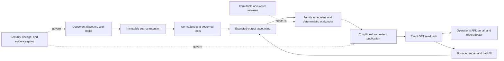

# PepperBall reporting platform case study

A sanitized, end-to-end portfolio case study by Thomas Ryan, Forward Deployed
Engineer Intern at PepperBall from May 2026 through August 2026.

The project evolved a document-driven manufacturing reporting workflow into a
governed platform spanning source discovery, medallion data processing,
deterministic spreadsheet products, canonical publication, expected-output
accounting, bounded self-healing, read-only operational interfaces,
observability, secure release controls, and evidence-driven handoff.

This repository is an independently written teaching artifact. It contains
synthetic data and generalized architecture. It excludes production source and
history, customer or employee data, credentials, private identifiers, live
templates, system coordinates, and operational exports.

## Reading path

- **One minute:** use the website for outputs, workflow, value, and technical foundation.
- **Presentation:** use the short deck for a live conversation.
- **Technical review:** open the long-form case study and synthetic workbook.
- **Technical review:** start with [end-to-end system](docs/end-to-end-system.md),
  [capability matrix](docs/system-capability-matrix.md), and
  [validation methodology](docs/validation-methodology.md).
- **Project history:** read the
  [sanitized workday chronology](docs/project-chronology.md).

## End-to-end system shape



The public representation stays at the capability and control-flow level. It
shows how the whole platform works without publishing tenant details, resource
identities, schema internals, ACLs, exact schedules, or production code.

## Verified engineering outcomes

- Deterministic two-sheet report products with client-independent stored values
  and explicit missing-versus-zero semantics.
- Same-item publication after qualified late evidence rather than alternate
  output creation.
- Accepted-write recovery through exact GET readback without a second PUT.
- Durable expected-output accounting capable of detecting a missing identity,
  not only a failed existing publication.
- Fair, bounded recovery that preserves security, ownership, and terminal holds.
- Immutable successor releases with output-suppressed validation, one active
  writer, and exact rollback.
- Natural equivalent-cycle verification as an immediate zero-write no-op.
- Durable Shift Draft catch-up after volatile retry metadata was replaced by
  stable source-version identity; the native recovery loop created the missing
  canonical workbook without a forced publication.

These are bounded engineering claims supported by tests, raw-package checks,
output-suppressed shadows, exact readback, rollback exercises, and natural
scheduled operation. They are not blanket accuracy, adoption, or financial
impact claims.

## Run the synthetic demo

Python 3.11 or newer is sufficient; the simulation has no third-party runtime
dependencies.

```bash
python demo/run_demo.py
python -m unittest discover -s tests -v
python scripts/public_safety_scan.py
```

The demo covers a missing source, late arrival, equivalent replay, lost write
response, GET-only settlement, one-writer exclusion, and exact rollback.

## Preview the portfolio site

```bash
npm install
npm run dev
```

Run `npm run check` before sharing. The site is static apart from client-side
audience and recovery selectors: it needs no database, API, cloud account, or
production connection.

## Publication state

This package is published under **All Rights Reserved**. Thomas Ryan authorized
the sanitized content boundaries and approved content commit `0b43336` for
public release on 2026-08-22. Open the
[portfolio website](https://thomas-ryan-reporting-reliability.tonnyryam.chatgpt.site).
See
[PUBLIC_RELEASE_MANIFEST.json](PUBLIC_RELEASE_MANIFEST.json) and
[publication checklist](docs/publication-checklist.md).

## Contact

[GitHub repository](https://github.com/tonnyryam/pepperball-reporting-platform-case-study) ·
[LinkedIn](https://www.linkedin.com/in/thomas-f-ryan/) ·
[Email](mailto:tommyryan.sf415@gmail.com)
