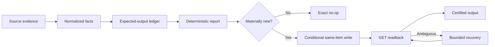

# PepperBall reporting reliability case study

An independent, sanitized portfolio case study by Thomas Ryan about making a
document-driven manufacturing reporting workflow deterministic, observable,
self-healing, and safe to retry.

This repository is a clean-room teaching artifact. It contains synthetic data,
generalized architecture, and independently written demonstration code. It does
not contain the production source tree, Git history, credentials, customer or
employee data, private identifiers, operational exports, report templates, or
screenshots from live systems.

## Thirty-second walkthrough

A scheduled reporting pipeline had to absorb late inputs, changing source
documents, lost HTTP responses, and long-lived repair obligations without
creating duplicate files or overwriting protected work. The reliability layer
uses durable expected-output accounting, governed material identity,
deterministic rendering, conditional same-item publication, GET-only settlement
after ambiguous writes, bounded repair, and exactly-one-writer releases with
exact rollback.

## My role

Thomas Ryan set the product goals, business definitions, safety invariants,
release priorities, acceptance criteria, and owner-only decisions. He materially
owned production diagnosis, implementation direction, regression strategy,
release/rollback decisions, and evidence-driven handoff. Codex-assisted
execution accelerated analysis, implementation, testing, evidence collection,
and documentation under that direction.

## System shape



The architecture and failure-state detail are in
[docs/architecture.md](docs/architecture.md) and
[docs/reliability-state-machine.md](docs/reliability-state-machine.md).

## Verified engineering outcomes

- Deterministic two-sheet report products with client-independent stored values
  and explicit missing-versus-zero treatment.
- Canonical same-item publication: late qualified evidence advances the intended
  output rather than creating an alternate file.
- Accepted-write recovery through exact GET readback without a second PUT.
- Durable, fair, bounded repair that preserves terminal ownership and security
  holds.
- Immutable successor releases, serialized handoffs, one active writer, and
  exact rollback.
- Immediate equivalent replay no-op after certified settlement.

These are engineering outcomes supported by tests, output-suppressed shadows,
exact readback, and natural operation. They are not blanket accuracy, adoption,
financial-impact, or causal-impact claims.

## Run the synthetic demo

Python 3.11 or newer is sufficient; the simulation has no third-party runtime
dependencies.

```bash
python demo/run_demo.py
python -m unittest discover -s tests -v
python scripts/public_safety_scan.py
```

The demo walks through a missing source, late arrival, equivalent replay, lost
write response, GET-only settlement, one-writer lease exclusion, and exact
rollback. All names and values are synthetic.

## Portfolio site

The one-page site lives in `app/` and can be previewed locally:

```bash
npm install
npm run dev
```

Run `npm run check` before sharing changes. Downloadable portfolio artifacts are
stored in `public/`.

## Share safely

Read [docs/claim-boundaries.md](docs/claim-boundaries.md) and
[docs/publication-checklist.md](docs/publication-checklist.md) before release.
The included safety scanner supplements GitHub secret scanning with patterns for
private paths, infrastructure identities, account data, and operational proof
material.

## Status

This is a public-release candidate. The code, data, diagrams, workbook, and PDF
are synthetic or generalized. Written company approval, preferred contact links,
final license choice, and final public repository URL remain owner-supplied
release fields.
