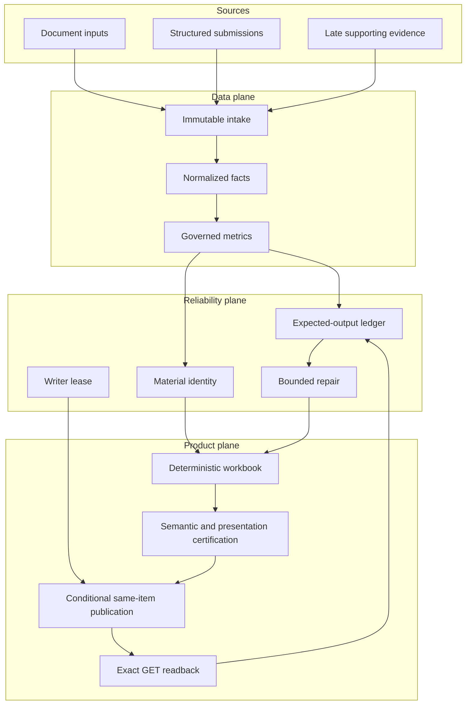
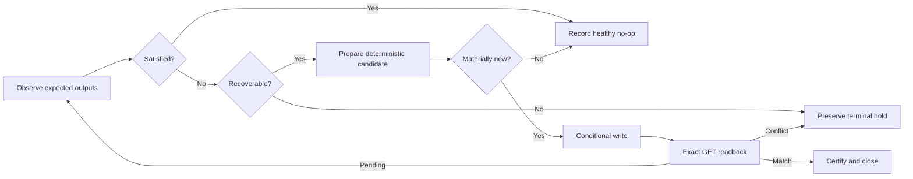

# Generalized architecture

This diagram intentionally uses broad component names. It does not reproduce
private resource names, accounts, paths, or network topology.

## Control loop

## Safety boundaries

- The data plane cannot publish directly.
- The renderer cannot invent missing facts.
- Repair cannot bypass the writer lease or terminal holds.
- An ambiguous accepted write can be resolved only by readback.
- A successor cannot overlap the active publisher.
