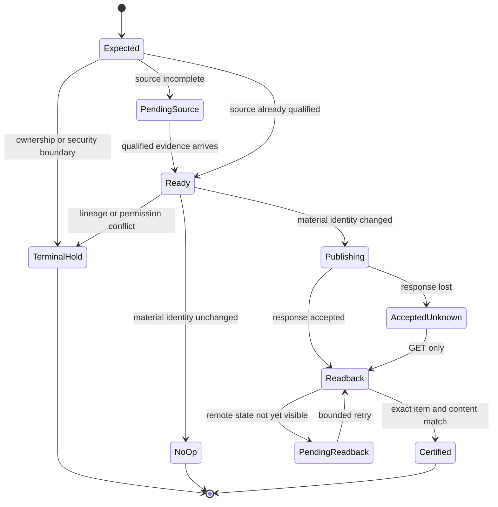

# Reliability state machine

## Key rules

- `AcceptedUnknown` never transitions back to `Publishing` for the same
  candidate. That prevents a second PUT.
- `PendingReadback` is bounded and retains the same candidate identity.
- `TerminalHold` is not a retry bucket; it requires an authorized external
  change before a new obligation can exist.
- `NoOp` is a successful result with zero mutation, not a skipped check.
